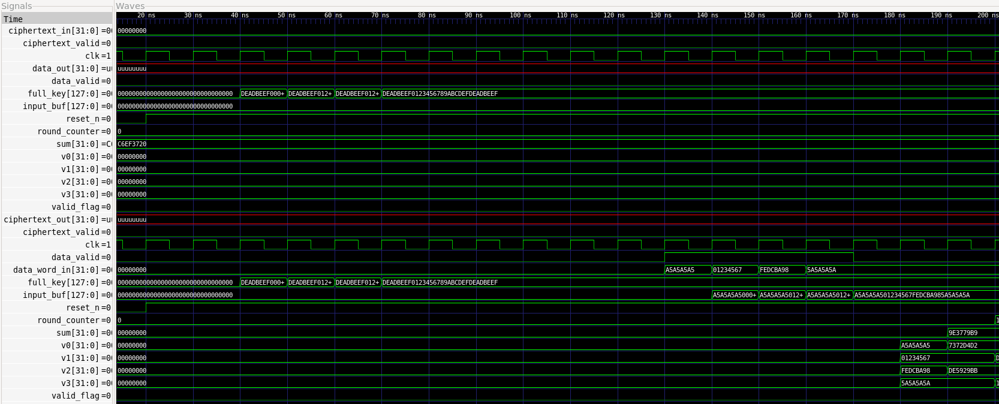
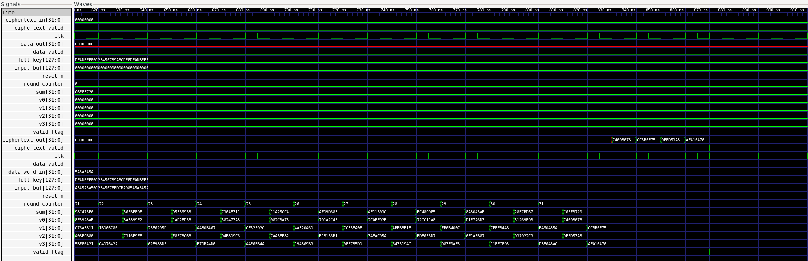
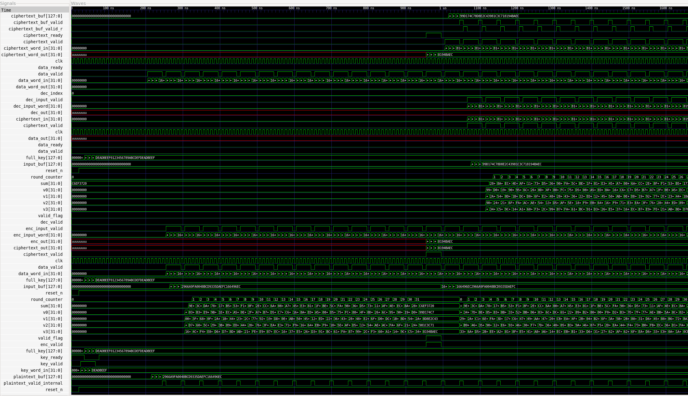

# FPGA-Based XTEA Cryptographic Accelerator

**Language:** VHDL / SystemVerilog  
**Tools:** Intel Quartus Prime, ModelSim, GHDL, GTKWave, TCL Scripting  
**Target Platform:** Altera DE1-SoC (Cyclone V)  
**Module:** Electronic System Design with FPGAs (WSC354) — Dr. Luciano Ost, Loughborough University

---

## Overview

This project implements a duplex hardware accelerator for the **eXtended Tiny Encryption Algorithm (XTEA)**, supporting both encryption and decryption on FPGA hardware. XTEA is a 64-bit block cipher with a 128-bit key operating over 32 Feistel rounds. The design processes a 128-bit plaintext as two independent 64-bit TEA pairs `(v0, v1)` and `(v2, v3)`.

The project covers two designs:

- **XTEA Duplex Core:** Standalone encryption and decryption pipeline verified against known test vectors
- **Cryptography System:** Full system integrating IP traffic generators, a NoC mini-router, and the XTEA core

Both designs were validated through simulation and synthesised for the Altera DE1-SoC (Cyclone V).

---

## Synthesis Results (XTEA Duplex Core — DE1-SoC, Cyclone V)

| Metric | Value |
|--------|-------|
| Frequency (Fmax) | 70.37 MHz |
| Logic Utilisation | 920 ALMs (3%) |
| Core Dynamic Power | 9.44 mW |
| Latency | 66 clock cycles per block |

---

## Architecture

### XTEA Duplex Core

The design consists of the following synthesisable modules:

- `xtea_enc.vhd` — Encryption core
- `xtea_dec.vhd` — Decryption core
- `xtea_top_duplex.vhd` — Top-level integrating both cores
- `xtea_tb.vhd` — Self-checking testbench (3 test vectors with pass/fail reporting)

The encryption and decryption cores implement 32 Feistel rounds using a **two-state EXEC approach**:

- **EXEC_A:** Updates `v0` and `v2` using pre-increment `sum`, then advances `sum += delta`
- **EXEC_B:** Updates `v1` and `v3` using the now-registered `v0`/`v2` and post-increment `sum`

This two-cycle approach is required in VHDL because signal assignments are **non-blocking** — all assignments in a clocked process take effect simultaneously at the next clock edge. A single-cycle EXEC causes `v1` to be computed using `v0_old` rather than `v0_new`, producing incorrect ciphertext. See the [Key Bug Fix](#key-bug-fix) section for full details.

**Throughput:** 64 clock cycles per 128-bit block (32 rounds × 2 states) plus ~10 cycles for loading and output streaming, giving approximately **148 total cycles** for a full encrypt + decrypt operation.

### Cryptography System

```
IP Enc Generator ──┐
                   ├──► Mini Router ──► cs_top logic ──► enc ──► dec ──► decrypted_block
IP Dec Generator ──┘    (byte arbitration)  (assemble 128b)
```

Additional modules:

- `mini_router.vhd` — Priority/round-robin arbitration router for multiplexed I/O
- `cs_top.vhd` — System top level with key feeding, plaintext streaming, and cipher buffering FSMs
- `ip_enc_gen.sv` / `ip_enc_gen.vhd` — Plaintext traffic generator
- `ip_dec_gen.sv` / `ip_dec_gen.vhd` — Decoy traffic generator

Both traffic generators feed byte streams into the mini-router, which arbitrates using priority and round-robin scheduling. The assembled 128-bit block is encrypted, the ciphertext is buffered, then fed into the decryption core. The final decrypted output recovers the original assembled block, verifying the enc→dec round trip.

---

## Key Bug Fix

The original single-cycle EXEC state had all four variable updates in one clocked process:

```vhdl
-- INCORRECT: All assignments execute simultaneously (VHDL non-blocking semantics)
v0  <= v0 + f(v1, sum);    -- uses v1_old ✓
sum <= sum + delta;         -- sum_new NOT visible in this cycle
v1  <= v1 + g(v0, sum);    -- uses v0_old ✗  (should use v0_new)
                            -- uses sum_old ✗ (should use sum_new)
```

The reference C code updates `v0` in-place before computing `v1`, so `v1` depends on the new `v0`. VHDL's non-blocking assignment model means this cannot be done in a single clock cycle.

**Fix:** EXEC is split into two registered sub-states so `v1`/`v3` see the correctly updated `v0`/`v2` and `sum` on the following clock edge:

```vhdl
-- EXEC_A: first half-round
v0  <= v0 + f(v1, sum);
v2  <= v2 + f(v3, sum);
sum <= sum + delta;
-- (signals register at next clock edge)

-- EXEC_B: second half-round — now sees new v0, v2, sum
v1  <= v1 + g(v0, sum);
v3  <= v3 + g(v2, sum);
```

This matches the reference C implementation exactly and was verified against all three test vectors.

---

## Repository Structure

```
├── XTEA_simulation/        # XTEA duplex core simulation files
│   ├── xtea_enc.vhd
│   ├── xtea_dec.vhd
│   ├── xtea_top_duplex.vhd
│   └── xtea_tb.vhd
│
├── XTEA_FPGA/              # XTEA duplex core Quartus project (DE1-SoC)
│
├── CS_simulation/          # Cryptography system simulation files
│   ├── cs_top.vhd
│   ├── mini_router.vhd
│   ├── xtea_enc.vhd
│   ├── xtea_dec.vhd
│   ├── xtea_top_duplex.vhd
│   ├── ip_enc_gen.sv       # Original (QuestaSim)
│   ├── ip_dec_gen.sv       # Original (QuestaSim)
│   ├── ip_enc_gen.vhd      # GHDL-compatible replacement
│   ├── ip_dec_gen.vhd      # GHDL-compatible replacement
│   └── cs_tb.vhd
│
├── CS_FPGA/                # Cryptography system Quartus project (DE1-SoC)
├── screenshots/            # Simulation waveforms
└── report/                 # Project report (PDF)
```

---

## Simulation

### XTEA Duplex Core — GHDL

```bash
sudo apt install ghdl gtkwave -y

cd XTEA_simulation
ghdl -a --std=08 xtea_enc.vhd
ghdl -a --std=08 xtea_dec.vhd
ghdl -a --std=08 xtea_top_duplex.vhd
ghdl -a --std=08 xtea_tb.vhd
ghdl -e --std=08 xtea_tb
ghdl -r --std=08 xtea_tb --vcd=xtea_wave.vcd --stop-time=10000ns
gtkwave xtea_wave.vcd
```

Expected output:
```
NOTE: Key/data pair 1 passed
NOTE: Key/data pair 2 passed
NOTE: Key/data pair 3 passed
NOTE: All tests passed
```

### Cryptography System — GHDL (using VHDL generator replacements)

```bash
cd CS_simulation
ghdl -a --std=08 ip_enc_gen.vhd
ghdl -a --std=08 ip_dec_gen.vhd
ghdl -a --std=08 mini_router.vhd
ghdl -a --std=08 xtea_enc.vhd
ghdl -a --std=08 xtea_dec.vhd
ghdl -a --std=08 xtea_top_duplex.vhd
ghdl -a --std=08 cs_top.vhd
ghdl -a --std=08 cs_tb.vhd
ghdl -e --std=08 cs_tb
ghdl -r --std=08 cs_tb --vcd=cs_wave.vcd --stop-time=50000ns
gtkwave cs_wave.vcd
```

> **Note on mixed-language:** The `.sv` files are the originals intended for QuestaSim. The `.vhd` files are functionally equivalent replacements for GHDL, which does not support mixed VHDL/SystemVerilog simulation.

### Cryptography System — QuestaSim / ModelSim

```tcl
vlib work
vlog ip_enc_gen.sv ip_dec_gen.sv
vcom -2008 mini_router.vhd
vcom -2008 xtea_enc.vhd
vcom -2008 xtea_dec.vhd
vcom -2008 xtea_top_duplex.vhd
vcom -2008 cs_top.vhd
vcom -2008 cs_tb.vhd
vsim work.cs_tb
run -all
```

---

## Test Vectors

| # | Key | Plaintext | Expected Ciphertext |
|---|-----|-----------|---------------------|
| 1 | `DEADBEEF01234567 89ABCDEFDEADBEEF` | `A5A5A5A501234567 FEDCBA985A5A5A5A` | `7409807B CC3B0E75 9EFD53A8 AEA16A76` |
| 2 | `7346772346534858 9734637824782378` | `FEDCBAFE DCBAFEDC BAFEDC BA FEDCBAFE` | `484CB4AD E7DA7886 B262FE21 701DF2B2` |
| 3 | `ABCDEFABCDEFABCD EFABCDEFABCDEFAB` | `46893489 23789423 89646238 12300325` | `5DD6C1FD AAC5F093 4C20AC7E 68E3D758` |

All three test vectors pass in simulation.

---

## Simulation Waveforms

### XTEA Duplex Core — Key and Plaintext Loading


### XTEA Duplex Core — Encryption Output


### Cryptography System — Full Pipeline
